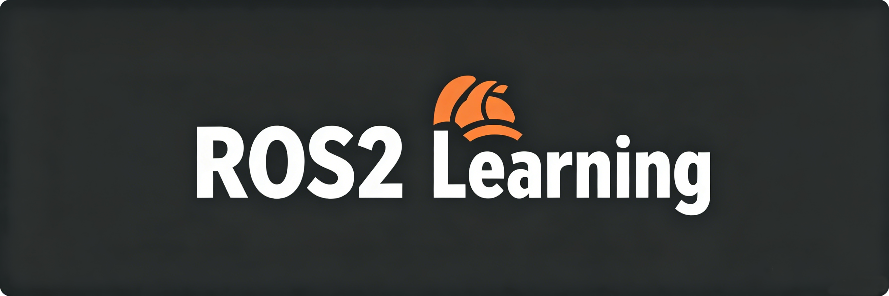

# ROS2-Learning-code

本项目基于ROS2 Jazzy，学习教程代码仓库。

仓库链接：https://github.com/vistar-terry/ROS2-Learning-code

博客链接：https://blog.csdn.net/maizousidemao/category_12840697.html

学习交流群：894013891（QQ群）、vistar_bot（加好友拉微信群）

## 使用说明

在 src 同级目录执行 `colcon build` 即可编译代码。
